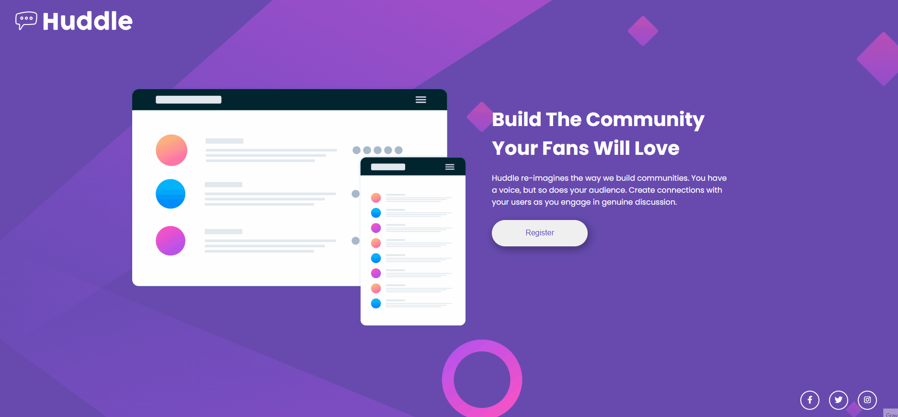

<h1 align="center" >Welcome to Huddle 🎉</h1>

  

This is my first project based on a frontend mentor challenge, even though it's still only the frontend design 😅 I will start doing the backend part on my next projects as I further my studies 😉

  

<h2>Preview</h2>

<h2>Technologies Used</h2>

  

Thank you for passing by 😊